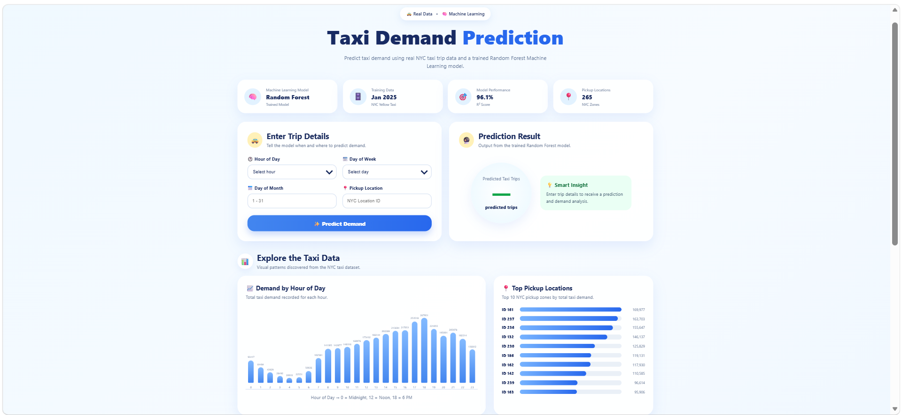

\# 🚕 Taxi Demand Prediction



A machine learning project that predicts taxi demand based on \*\*time and pickup location\*\* using real-world NYC Yellow Taxi trip data.


The project processes millions of taxi trip records, performs exploratory data analysis and feature engineering, trains a Random Forest Regression model, evaluates its performance, and integrates the trained model into a Flask web application.


\---


### Project Workflow


Raw Taxi Data
      ↓
Data Inspection
      ↓
Data Aggregation
      ↓
Exploratory Data Analysis
      ↓
Feature Engineering
      ↓
Train / Test Split
      ↓
Random Forest Regressor
      ↓
Model Evaluation
      ↓
Model Serialization
      ↓
Flask Web Application
      ↓
Taxi Demand Prediction
```